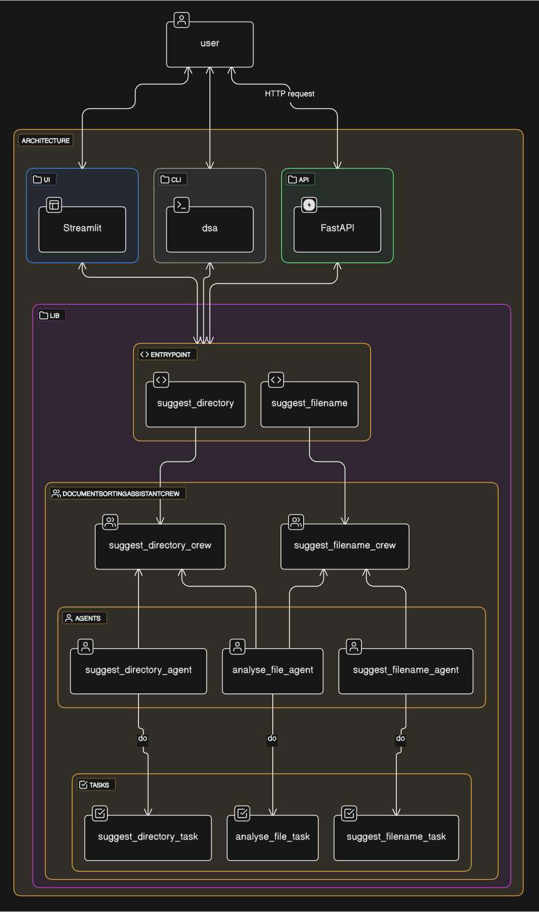

# Document Sorting Assistant

An intelligent assistant to automatically organize and classify your documents using AI.

## Features

- File name suggestions based on content
- Automatic document classification
- Streamlit user interface
- REST API with FastAPI
- Docker support for deployment

## Architecture



The project is structured into several main components:
- User Interface (Streamlit)
- Command Line Interface (CLI)
- REST API (FastAPI)
- Core library with:
  - Document analysis agents
  - File reading tools
  - Text and markdown processing tools

## Prerequisites

- Python 3.11 or higher
- pip (Python package manager)
- Docker (optional, for deployment)

## Installation

### Basic Installation
```bash
pip install .
```

### Installation with Streamlit UI
```bash
pip install .[streamlit]
```

### Installation with FastAPI
```bash
pip install .[fastapi]
```

### Development Installation
```bash
pip install .[ci,cd]
```

## Usage

### Command Line Interface (CLI)
```bash
# Suggest a filename
suggest_filename -f <filename>

# Suggest a directory
suggest_directory -f <filename> -d <directory1> -d <directory2> ...
```

### Streamlit User Interface
```bash
# by installed script
run_ui
# or directly with streamlit
streamlit run src/streamlit_entrypoint.py
```

### FastAPI
```bash
run_api
```

## Deployment

### Local Deployment with Docker
```bash
# Launch with docker-compose
docker-compose up --build
```

## Development

### Tests
```bash
# Install test dependencies
pip install .[integration]

# Run tests
pytest
```

### Linting
```bash
# Check code style
cd src
black .
flake8
```

### Packaging
```bash
# Build Python package
python -m build
```

## Configuration

The project uses a `.env` file for configuration. Rename `.env.example` to `.env` and modify the variables according to your needs.

### Environment Variables:
- `OPEN_API_KEY`: Your OpenAI API key for AI features

## Contact

For any questions or suggestions, contact [Mehdi](mailto:mehdi.halitim@foxonconsulting.com).
